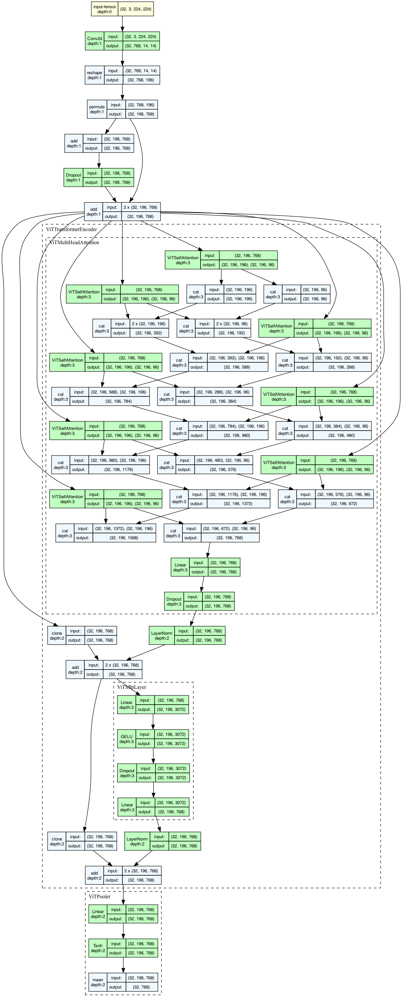

# Reverse Image Search

Implement a __Multi-Modal Reverse Search Engine__, using methods similar to CLIP (Contrastive Language to Image Pretraining).

## CLIP


## Models

### BERT
- Implemented BERT from scratch to fine-tune the language encoder.
- The below image contains the model for just one encoder block.

```
BertModel(
  (embedding): Embedding(30522, 768)
  (position_embeddings): BertEmbeddings(
    (dropout): Dropout(p=0.1, inplace=False)
  )
  (encoder): BertEncoder(
    (layers): ModuleList(
      (0-11): 12 x BertLayer(
        (layernorm1): LayerNorm((768,), eps=1e-05, elementwise_affine=True)
        (layernorm2): LayerNorm((768,), eps=1e-05, elementwise_affine=True)
        (mha): BertAttention(
          (heads): ModuleList(
            (0-7): 8 x BertSelfAttention(
              (query): Linear(in_features=768, out_features=96, bias=True)
              (key): Linear(in_features=768, out_features=96, bias=True)
              (value): Linear(in_features=768, out_features=96, bias=True)
              (dropout): Dropout(p=0.1, inplace=False)
            )
          )
          (output): BertSelfOutput(
            (dense): Linear(in_features=768, out_features=768, bias=True)
            (LayerNorm): LayerNorm((768,), eps=1e-12, elementwise_affine=True)
            (dropout): Dropout(p=0.1, inplace=False)
          )
        )
        (output): BertOutput(
          (linear1): Linear(in_features=768, out_features=768, bias=True)
          (linear2): Linear(in_features=768, out_features=768, bias=True)
        )
      )
    )
    (intermediate): BertIntermediate(
      (dense): Linear(in_features=768, out_features=3072, bias=True)
      (intermediate_act_fn): GELU(approximate='none')
    )
    (output): BertSelfOutput(
      (dense): Linear(in_features=3072, out_features=768, bias=True)
      (LayerNorm): LayerNorm((768,), eps=1e-12, elementwise_affine=True)
      (dropout): Dropout(p=0.1, inplace=False)
    )
  )
  (pooler): BertPooler(
    (dense): Linear(in_features=768, out_features=768, bias=True)
    (activation): Tanh()
  )
)
```


### ViT

```
ViTModel(
  (patch_embed): ViTPatchEmbedding(
    (layer): Conv2d(3, 768, kernel_size=(16, 16), stride=(16, 16))
  )
  (positional_embed): ViTPositionEmbedding(
    (dropout): Dropout(p=0.1, inplace=False)
  )
  (encoder): ModuleList(
    (0-5): 6 x ViTTransformerEncoder(
      (mha): ViTMultiHeadAttention(
        (heads): ModuleList(
          (0-7): 8 x ViTSelfAttention(
            (query): Linear(in_features=768, out_features=96, bias=True)
            (key): Linear(in_features=768, out_features=96, bias=True)
            (value): Linear(in_features=768, out_features=96, bias=True)
            (dropout): Dropout(p=0.1, inplace=False)
          )
        )
        (output): Linear(in_features=768, out_features=768, bias=True)
        (dropout): Dropout(p=0.1, inplace=False)
      )
      (layer_norm_1): LayerNorm((768,), eps=1e-12, elementwise_affine=True)
      (layer_norm_2): LayerNorm((768,), eps=1e-12, elementwise_affine=True)
      (mlp): ViTMlpLayer(
        (mlp_activation_fn): GELU(approximate='none')
        (linear_1): Linear(in_features=768, out_features=3072, bias=True)
        (linear_2): Linear(in_features=3072, out_features=768, bias=True)
        (dropout): Dropout(p=0.1, inplace=False)
      )
    )
  )
  (pooler): ViTPooler(
    (dense): Linear(in_features=768, out_features=768, bias=True)
    (activation): Tanh()
  )
)
```


- The below image contains the model for just one encoder block.




### ResNet101


